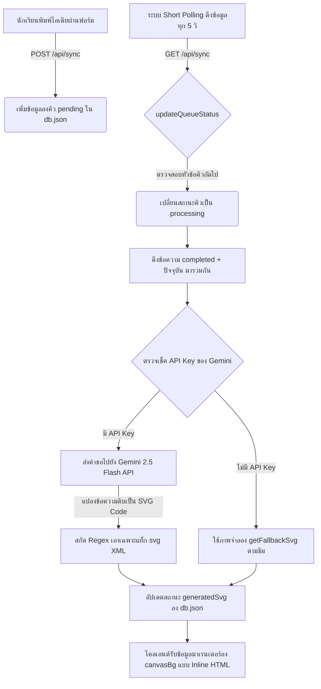

# ระบบแปลงข้อความคำสั่งเป็นภาพเวกเตอร์ด้วย AI (Prompt-to-SVG Generation System)

เอกสารฉบับนี้อธิบายกลไกการทำงานของระบบประมวลผลคำขอ (Requirement Queue) และการสื่อสารกับโมเดล Google Gemini API ในการสังเคราะห์ภาพเวกเตอร์ร่วมกัน (Collaborative SVG Canvas) ของโครงการ **Tha Khlong Collaborative Canvas**

---

## 1. ภาพรวมระบบ (System Overview)

ระบบไม่ได้ใช้โมเดลสร้างรูปภาพที่เป็นพิกเซลแบบเดิม (เช่น PNG, JPEG จาก Stable Diffusion หรือ DALL-E) แต่เปลี่ยนมาใช้ **Google Gemini 2.5 Flash** ในการแปลงข้อความคำเสนอของเด็กนักเรียนให้เป็นโค้ดภาพเวกเตอร์ **SVG XML** แบบสด ๆ ซึ่งมีข้อดีคือ:
- **ส่งข้อมูลปริมาณน้อย (Bandwidth Efficient)**: ส่งโค้ดตัวอักษรแทนภาพความละเอียดสูง ช่วยประหยัดอินเทอร์เน็ตในโรงเรียน
- **รองรับการแก้ไขซ้อนทับ (Collaborative Layering)**: หน้าจอแคนวาสสามารถวางเลเยอร์ภาพเวกเตอร์จาก AI ร่วมกับการวาดเส้นและวางตราแสตมป์จากนักเรียนได้พร้อมกัน
- **ความละเอียดไม่จำกัด (Vector Quality)**: ภาพคมชัดบนหน้าจอทุกขนาด (Responsive) ตั้งแต่หน้าจอนักเรียนไปจนถึงโปรเจกเตอร์หน้าห้องเรียน

---

## 2. แผนผังกลไกการทำงาน (System Architecture Flow)

กลไกตั้งแต่การเสนอข้อความไอเดียไปจนถึงการวาดแสดงผลภาพเวกเตอร์บนกระดานแชร์ไอเดีย:



---

## 3. โครงสร้างข้อมูล (Data Structures)

ระบบจัดเก็บสถานะไว้ที่ไฟล์ [db.json](file:///d:/nextjs/tha-khlong-ai/db.json) และอ่าน/เขียนผ่านโมดูลหลัก [lib/db.ts](file:///d:/nextjs/tha-khlong-ai/lib/db.ts) โดยมีฟิลด์ข้อมูลสำคัญที่เกี่ยวกับการเจนรูปภาพดังนี้:

### โครงสร้างความต้องการ (Requirement Schema)
```typescript
export interface Requirement {
  id: string;
  text: string;                             // ข้อความไอเดียที่พิมพ์ เช่น "ยานอวกาศชนดาวหาง"
  author: string;                           // ชื่อของเด็กผู้เสนอคิว
  status: 'pending' | 'processing' | 'completed'; // สถานะคิวปัจจุบัน
  theme?: 'default' | 'space' | 'pink' | 'matrix' | 'neon';
  effect?: 'none' | 'confetti' | 'snow' | 'bubbles';
  stamps?: string[];
}
```

### โครงสร้างสถานะรวม (AppState Schema)
```typescript
export interface AppState {
  requirements: Requirement[];
  currentStartedAt: number | null; // Timestamp สำหรับวัดระยะเวลาการรันคิว (30 วินาที)
  isCompiling: boolean;            // บอกว่าอยู่ในช่วง 5 วินาทีแรกที่จำลองหน้า "AI Coding" หรือไม่
  activeTheme: string;             // คีย์ของธีมกระดานปัจจุบัน
  activeEffect: string;            // เอฟเฟกต์สภาพแวดล้อมปัจจุบัน
  generatedSvg: string;            // เก็บตัวแปรโค้ดภาพเวกเตอร์ SVG ดิบ
  geminiApiKey: string;            // API Key สดที่ครูบันทึกผ่านทาง Admin Control Panel
}
```

---

## 4. วงจรชีวิตคิวและการจำลองการเขียนโค้ด (Queue & Live Coding Lifecycle)

ในฟังก์ชัน [updateQueueStatus](file:///d:/nextjs/tha-khlong-ai/lib/db.ts) ระบบจัดการดึงคิวการประมวลผลขึ้นมาทำงานทีละชิ้นตามลำดับ FIFO:

1. **ช่วงประมวลผลและเรียกใช้ API**:
   - เมื่อหยิบบอร์ดเพนดิ้งขึ้นมา ระบบจะเริ่มเซ็ตสถานะบอร์ดเป็น `processing` และ `isCompiling = true` พร้อมทั้งระบุเวลา `startedAt` เพื่อจับเวลาคอมไพล์ความก้าวหน้า
   - หน้าจอ UI ของบอร์ดนี้จะแสดงแอนิเมชัน "AI Live Coding" และตัวเลขนับความคืบหน้า (จำลองขึ้นมา 0% - 100% ภายใน 5 วินาทีเพื่อให้ดูสมจริงหรือแสดงผลจนเสร็จ)
   - ในเบื้องหลัง ระบบจะเรียกยิงเรียกใช้บริการ Gemini API ทันทีเพื่อสังเคราะห์ภาพเวกเตอร์ SVG
2. **การตอบกลับและแสดงผลทันที**:
   - เมื่อ Gemini API ส่งผลลัพธ์กลับมาเรียบร้อยแล้ว (ไม่ว่าจะสำเร็จหรือล้มเหลว) ระบบจะทำการปรับสถานะบอร์ดนั้นเป็น `completed` (สำเร็จ) หรือ `failed` (ล้มเหลว) พร้อมกับปรับสถานะ `isCompiling = false` เพื่อปิดหน้าจอจำลองการคอมไพล์โค้ดในทันทีโดยไม่ต้องหน่วงเวลารอใดๆ อีก
   - เมื่อระบบอัปเดตสถานะและบรอดแคสต์ผ่าน WebSockets ไปแล้ว เครื่องไคลเอนต์ของเด็กๆ จะปิดหน้าจอ Live Coding และแสดงผลภาพเวกเตอร์ SVG ที่สร้างขึ้นมาตามที่ร้องขอทันที

> [!NOTE]
> ระบบ WebSocket Companion Server จะคอยรันฟังก์ชัน `updateQueueStatus` ทุกๆ 1 วินาทีในลักษณะ Background Job เพื่อประสานงานคิวและบรอดแคสต์ความคืบหน้าแบบเรียลไทม์

---

## 5. กลไกสะสมไอเดีย (Cumulative Prompt Generation)

หัวใจสำคัญของการทำงานร่วมกันของเด็กๆ คือ **ภาพจะขยายตัวและมีของสะสมเพิ่มขึ้นเรื่อยๆ ตามประวัติคิว** แทนที่จะวาดรูปข้อใครข้อมันเดี่ยวๆ โดยมีกลไกในฟังก์ชัน [startNextPending](file:///d:/nextjs/tha-khlong-ai/lib/db.ts#L279-L317) ดังนี้:

1. ดึงข้อความข้อที่เคยประมวลผลสำเร็จแล้วมารวมเข้ากับคำขอปัจจุบัน:
   ```typescript
   const completedPrompts = state.requirements
     .filter(r => r.status === 'completed')
     .map(r => r.text);
   const allPrompts = [...completedPrompts, nextReq.text];
   ```
2. ต่อข้อความคำสั่งทั้งหมดเข้าด้วยกันเป็นลิสต์ตัวเลข:
   ```typescript
   const combinedPromptText = allPrompts.map((p, idx) => `${idx + 1}. ${p}`).join('\n');
   ```
3. ส่ง `combinedPromptText` ไปขอรูปภาพจาก AI ทำให้ Gemini สังเคราะห์ภาพที่ **มีองค์ประกอบเก่าสะสมรวมเข้ากับองค์ประกอบใหม่** เสมอ

---

## 6. การเชื่อมต่อและ Prompt Engineering ของ Gemini

ฟังก์ชัน [fetchGeminiSvg](file:///d:/nextjs/tha-khlong-ai/lib/gemini.ts#L2-L52) ทำหน้าที่ยิงขอข้อมูลไปยัง Google Gemini API:

### ⚙️ การตั้งค่าคำสั่ง (System Instruction)
ระบบควบคุมคำตอบของ Gemini ด้วยการเขียน Prompt ที่รัดกุมเพื่อให้ได้เฉพาะ SVG XML:
```typescript
text: `You are an expert SVG designer. Create a beautiful, clean, extremely cute vector illustration in SVG format for children.
The drawing requests are accumulated from different children in a classroom. You MUST combine all of the following elements/requests into one single, cohesive, beautiful scene:
${prompt}

Guidelines:
1. Output ONLY valid, raw, clean SVG code wrapped inside a single \`\`\`xml ... \`\`\` code block. Do NOT write any chat conversations, explanations, markdown comments outside, or CSS animations that are too complex.
2. The SVG MUST have viewBox="0 0 800 600" and use width="100%" height="100%".
3. Use simple, colorful flat vector shapes: <rect>, <circle>, <ellipse>, <path>, <polygon>, <g>, etc.
4. Ensure it has a solid colorful background element (like <rect width="800" height="600" fill="..."/>) to act as a nice drawing background canvas sheet.
5. All text elements should be clearly visible with readable fonts.
6. Make it completely self-contained. Do not use external image references.`
```

### 🧹 การสกัดและทำความสะอาดผลลัพธ์ (Output Extraction)
เนื่องจากบางครั้ง LLM อาจคืนข้อความอธิบายภายนอกบล็อกโค้ด ระบบจึงใช้กลไกการสกัดข้อความสองระดับ:
1. **บล็อก Markdown**: ดึงเฉพาะโค้ดที่อยู่ภายใต้ ` ```xml ` หรือ ` ``` `
   ```typescript
   const match = text.match(/```(?:xml|html)?([\s\S]*?)```/);
   let svg = match ? match[1].trim() : text.trim();
   ```
2. **ขอบเขตแฮนเดิล XML**: ค้นหาตำแหน่งดัชนีของ `<svg` และ `</svg>` และหั่นข้อความคัดเลือกเฉพาะส่วนเวกเตอร์ เพื่อป้องกันไม่ให้มีข้อความแปลกปลอมหลุดเข้าไปพังโครงสร้าง HTML
   ```typescript
   const startIndex = svg.indexOf('<svg');
   const endIndex = svg.lastIndexOf('</svg>');
   if (startIndex !== -1 && endIndex !== -1) {
     svg = svg.substring(startIndex, endIndex + 6); // +6 เพื่อรวมความยาว "</svg>"
   }
   ```

---

## 7. ระบบสำรองข้อมูลเมื่อเชื่อมต่อไม่ได้ (Mock Fallback System)

หากไม่มี API Key หรือการเชื่อมต่อเซิร์ฟเวอร์ล้มเหลว ระบบจะตัดการทำงานเข้าสู่ฟังก์ชัน [getFallbackSvg](file:///d:/nextjs/tha-khlong-ai/lib/db.ts#L110-L215) ทันที โดยจะส่งโค้ดโครงร่าง SVG สำรองที่มีอนิเมชั่นและองค์ประกอบเวกเตอร์ระดับพื้นฐานตามประเภทธีมที่ตรงกับคำค้นหา:

- **ธีมอวกาศ (`space`)**: วาดรูปโลก ดาวเสาร์ และจรวดยานอวกาศหมุนทำมุม
- **ธีมพาสเทล (`pink`)**: วาดรูปก้อนเมฆและไอศกรีมสีหวาน
- **ธีมสีเขียวไอที (`matrix`)**: วาดรูปหน้าจอหุ่นยนต์ Matrix ไอบอท
- **ธีมธรรมชาติทั่วไป (`default`)**: วาดรูปพระอาทิตย์ ภูเขา บ้าน และต้นไม้

*การเรนเดอร์เหล่านี้ยังคงนำข้อความคำสั่งเสนอแนะมาเขียนใส่ไว้ใน `<text>` ด้านล่างเพื่ออ้างอิงชื่อคำขอของนักเรียนได้เช่นกัน*
