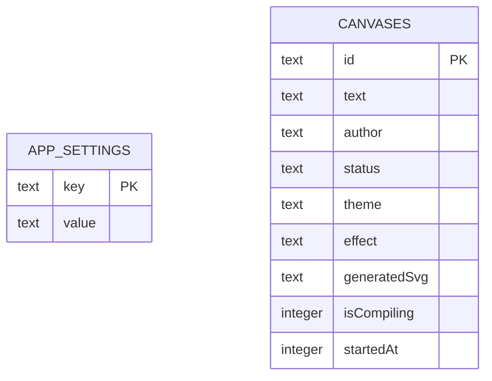

# เอกสารออกแบบฐานข้อมูล SQLite (SQLite Database Schema Design)

เอกสารฉบับนี้อธิบายการออกแบบตารางฐานข้อมูล โครงสร้างประเภทข้อมูล และคำสั่งภาษา SQL สำหรับการย้ายระบบจัดเก็บสถานะจากไฟล์ JSON มาเป็นฐานข้อมูล **SQLite (ไฟล์ `tha_khlong.db`)** โดยลบฟังก์ชันการวาดเขียนออกทั้งหมด และเป็นไปตาม **นโยบายความปลอดภัยคีย์ API (Strict Environment Key Policy)** ที่ไม่กรอกคีย์ผ่านหน้าเว็บและไม่บันทึกคีย์ลงในฐานข้อมูลเด็ดขาด (โหลดคีย์เฉพาะจาก `.env.local` เท่านั้น)

---

## 1. แผนภาพความสัมพันธ์ของข้อมูล (Database Schema Diagram)

ข้อมูลทั้งหมดถูกจัดเก็บลงใน 2 ตารางในฐานข้อมูล SQLite:



---

## 2. รายละเอียดตารางและคอลัมน์ (Table Schema Specifications)

### 2.1 ตารางตั้งค่าแอปทั่วไป (`app_settings`)
ใช้สำหรับบันทึกค่าสถานะทั่วไปในระดับ Global ของแอปพลิเคชัน
* **นโยบายความปลอดภัย**: ห้ามบันทึก API Keys ลงในตารางนี้โดยเด็ดขาด จะจัดเก็บเฉพาะสถานะการรับส่งชิ้นงานทั่วไป

| คอลัมน์ (Column) | ประเภทข้อมูล (SQLite Type) | คีย์ (Key) | เงื่อนไขเพิ่มเติม (Constraints) | คำอธิบาย (Description) |
|---|---|---|---|---|
| `key` | TEXT | PK | NOT NULL | คีย์ระบุการตั้งค่า (เช่น `acceptingSubmissions`) |
| `value` | TEXT | - | - | ค่าของการตั้งค่า (เช่น `'true'` หรือ `'false'`) |

### 2.2 ตารางข้อมูลกระดานแคนวาส AI (`canvases`)
ใช้เก็บรายละเอียดของชิ้นงานกระดานแต่ละใบที่ถูกสร้างขึ้นโดยนักเรียนในห้องเรียน
* **วัตถุประสงค์**: บันทึกข้อมูลคิว, หัวข้อของภาพ และผลลัพธ์โค้ดเวกเตอร์ SVG ที่ได้จาก AI

| คอลัมน์ (Column) | ประเภทข้อมูล (SQLite Type) | คีย์ (Key) | เงื่อนไขเพิ่มเติม (Constraints) | คำอธิบาย (Description) |
|---|---|---|---|---|
| `id` | TEXT | PK | NOT NULL | ไอดีสุ่มความยาว 7 ตัวอักษร |
| `text` | TEXT | - | NOT NULL | หัวข้อ/Prompt วาดรูปภาษาไทย |
| `author` | TEXT | - | NOT NULL | ชื่อเล่นของนักเรียนผู้สร้างบอร์ด |
| `status` | TEXT | - | DEFAULT 'pending' | สถานะประมวลผล (`pending`, `processing`, `completed`) |
| `theme` | TEXT | - | DEFAULT 'default' | ธีมกระดาน (`default`, `space`, `pink`, `matrix`, `neon`) |
| `effect` | TEXT | - | DEFAULT 'none' | เอฟเฟกต์สภาพแวดล้อม (`none`, `confetti`, `snow`, `bubbles`) |
| `generatedSvg` | TEXT | - | - | โค้ดเวกเตอร์ SVG ดิบที่ Gemini API เจนเนอเรตให้ |
| `isCompiling` | INTEGER | - | DEFAULT 0 | สถานะกำลังถอดรหัส (0 = false, 1 = true) |
| `startedAt` | INTEGER | - | - | เวลาเริ่มต้นเริ่มรอบคิวเป็น Timestamp (หน่วยมิลลิวินาที) |

---

## 3. คำสั่งติดตั้งตารางเริ่มต้น (DDL Initialization Queries)

เมื่อระบบเริ่มต้นทำงานครั้งแรก จะรันคำสั่ง SQL สร้างตารางดังนี้:

```sql
-- 1. สร้างตารางตั้งค่าแอป
CREATE TABLE IF NOT EXISTS app_settings (
    key TEXT PRIMARY KEY,
    value TEXT
);

-- 2. สร้างตารางกระดานแคนวาส AI
CREATE TABLE IF NOT EXISTS canvases (
    id TEXT PRIMARY KEY,
    text TEXT NOT NULL,
    author TEXT NOT NULL,
    status TEXT DEFAULT 'pending',
    theme TEXT DEFAULT 'default',
    effect TEXT DEFAULT 'none',
    generatedSvg TEXT,
    isCompiling INTEGER DEFAULT 0,
    startedAt INTEGER
);
```

---

## 4. ตัวอย่างคำสั่งคิวรี่หลัก (SQL Query Examples)

### 4.1 การดึงแคนวาสทั้งหมดเรียงลำดับคิว
```sql
SELECT * FROM canvases ORDER BY startedAt ASC;
```

### 4.2 การสร้างแคนวาสใหม่รอคิว (FIFO Queue Queueing)
```sql
INSERT INTO canvases (id, text, author, status, theme, effect, isCompiling, startedAt)
VALUES ('canvas_abc', 'บ้านในสวนคริสต์มาสมีหิมะตก', 'น้องภูมิ', 'pending', 'default', 'none', 0, NULL);
```

### 4.3 การบันทึกภาพ SVG ที่ตอบกลับจาก AI
```sql
UPDATE canvases
SET generatedSvg = ?, status = 'processing', isCompiling = 1
WHERE id = ?;
```
